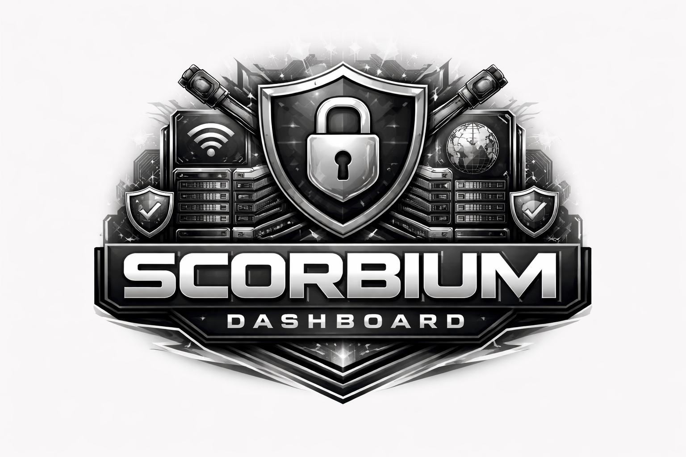

<div align="center">



# VPN Dashboard

**Полноценная платформа для управления VPN-сервисом**

[](https://python.org)
[](https://fastapi.tiangolo.com)
[](https://aiogram.dev)
[](https://postgresql.org)
[](https://docker.com)
[](LICENSE)

[Возможности](#-возможности) · [Стек](#-стек) · [Быстрый старт](#-быстрый-старт) · [Деплой](#-деплой-на-сервер) · [Конфигурация](#-конфигурация) · <a href='https://t.me/scorbium_dashboard'>Telegram Channel</a>

</div>

---

## 📋 О проекте

**VPN Dashboard** — это комплексное решение для управления VPN-сервисом на базе Marzban/PasarGuard. Включает веб-панель администратора, Telegram-бота для пользователей и полную интеграцию с платёжными системами.

```
┌─────────────────────────────────────────────────────────┐
│                    VPN Dashboard                        │
│                                                         │
│  ┌──────────────┐  ┌──────────────┐  ┌──────────────┐  │
│  │  Web Panel   │  │  Telegram    │  │   Marzban    │  │
│  │  (FastAPI +  │  │    Bot       │  │  Integration │  │
│  │   Jinja2)    │  │  (aiogram 3) │  │  (PasarGuard)│  │
│  └──────────────┘  └──────────────┘  └──────────────┘  │
│           │                │                │           │
│           └────────────────┴────────────────┘           │
│                            │                            │
│                    ┌───────────────┐                    │
│                    │  PostgreSQL   │                    │
│                    └───────────────┘                    │
└─────────────────────────────────────────────────────────┘
```

---

## ✨ Возможности

### 🖥 Веб-панель администратора
- **Дашборд** — статистика в реальном времени, график выручки за 7 дней
- **Пользователи** — управление, бан/разбан, пополнение баланса, подарок подписки
- **Подписки** — просмотр, продление, отзыв VPN-ключей
- **Тарифы** — создание и управление планами подписки
- **Платежи** — история, возвраты, статусы
- **Промокоды** — скидки, баланс, дни к подписке
- **Рефералы** — статистика, топ рефереров
- **Поддержка** — тикет-система с ответами
- **Рассылки** — массовые сообщения пользователям
- **Telegram** — настройка бота, кастомизация, фото для разделов
- **PasarGuard** — управление VPN-панелью, группы, ноды, пользователи
- **Редактор клавиатуры** — drag & drop конструктор меню бота с превью

### 🤖 Telegram-бот
- Покупка подписок (ЮКасса, Telegram Stars, баланс)
- Просмотр и управление подписками
- Профиль пользователя (`/profile`)
- Статус серверов (`/ping`)
- Топ рефереров (`/top`)
- Подарить подписку другу (`/gift @username`)
- Автопродление с баланса
- Уведомления за 3 дня до истечения
- Обязательная подписка на канал
- Антиспам middleware (token bucket)

### 💳 Платёжные системы
- **ЮКасса** — банковские карты, webhook + polling
- **Telegram Stars** — встроенные платежи
- **Баланс** — внутренний счёт пользователя

### 🔒 Безопасность
- JWT авторизация панели (cookie-based)
- Rate limiting (панель: 120 req/min, API: 60 req/min)
- Антиспам для бота
- Защита от самобана администратора

---

## 🛠 Стек

| Компонент | Технология |
|-----------|-----------|
| Backend | FastAPI + Python 3.13 |
| Bot | aiogram 3.x |
| Database | PostgreSQL 15 + SQLAlchemy 2 (async) |
| Migrations | Alembic |
| Templates | Jinja2 + HTMX + Bootstrap 5.3 |
| VPN Panel | Marzban / PasarGuard API |
| Payments | ЮКасса, Telegram Stars |
| Proxy | Nginx |
| Container | Docker + Docker Compose |
| Package manager | uv |

---

## 🚀 Быстрый старт

### Требования
- Docker + Docker Compose v2
- Git

### Локальный запуск

```bash
# 1. Клонировать репозиторий
git clone https://github.com/your/vpn-dashboard.git
cd vpn-dashboard

# 2. Запустить интерактивный setup
bash setup.sh
# Выбрать режим 2 (Разработка)

# 3. Применить миграции
docker compose exec app uv run alembic upgrade head
```

Панель: **http://localhost/panel/**

---

## 🌐 Деплой на сервер

### Требования
- Ubuntu 20.04+ / Debian 11+
- Домен с A-записью на IP сервера
- Открытые порты 80, 443

### Установка Docker
```bash
curl -fsSL https://get.docker.com | sh
systemctl enable --now docker
```

### Деплой
```bash
# 1. Скопировать проект
git clone https://github.com/your/vpn-dashboard.git /opt/vpn-dashboard
cd /opt/vpn-dashboard

# 2. Настроить окружение
cp .env.example .env
nano .env  # заполнить все переменные

# 3. Настроить домен в nginx
sed -i 's/YOUR_DOMAIN/your-domain.com/g' nginx/nginx.conf

# 4. Открыть порты
ufw allow 80 && ufw allow 443 && ufw allow 22

# 5. Запустить (HTTP для получения сертификата)
docker compose -f docker-compose.prod.yml up -d db app

# 6. Получить SSL сертификат
docker compose -f docker-compose.prod.yml run --rm certbot certonly \
  --webroot --webroot-path=/var/www/certbot \
  --email your@email.com --agree-tos --no-eff-email \
  -d your-domain.com

# 7. Запустить с SSL
docker compose -f docker-compose.prod.yml up -d
docker compose -f docker-compose.prod.yml exec app uv run alembic upgrade head
```

Панель: **https://your-domain.com/panel/**

### Обновление
```bash
cd /opt/vpn-dashboard
git pull
docker compose -f docker-compose.prod.yml build app
docker compose -f docker-compose.prod.yml up -d app
```

---

## ⚙️ Конфигурация

Скопируй `.env.example` в `.env` и заполни:

```env
# Приложение
APP_NAME=VPN Dashboard
APP_VERSION=1.0.0

# Веб-сервер
SERVER_HOST=0.0.0.0
SERVER_PORT=8000
ALLOWED_ORIGINS=["https://your-domain.com"]

# Панель администратора
WEB_SUPERADMIN_USERNAME=admin
WEB_SUPERADMIN_PASSWORD=your_secure_password

# Telegram
TELEGRAM_BOT_TOKEN=1234567890:AABBccDDeeFFggHH
TELEGRAM_ADMIN_IDS=[123456789]
TELEGRAM_TYPE_PROTOCOL=webhook          # webhook | long
TELEGRAM_WEBHOOK_URL=https://your-domain.com/webhook/bot
TELEGRAM_WEBHOOK_PATH=/webhook/bot

# Marzban / PasarGuard
PASARGUARD_ADMIN_PANEL=https://panel.example.com:8012
PASARGUARD_ADMIN_LOGIN=admin
PASARGUARD_ADMIN_PASSWORD=password

# ЮКасса
YOOKASSA_SHOP_ID=1234567
YOOKASSA_SECRET_KEY=test_your_key

# База данных
DB_NAME=vpnbot
DB_HOST=db
DB_PORT=5432
DB_USER=postgres
DB_PASSWORD=secure_password
```

---

## 📁 Структура проекта

```
vpn-dashboard/
├── app/
│   ├── api/
│   │   ├── panel/          # Веб-панель (HTMX + Jinja2)
│   │   ├── v1/             # REST API
│   │   └── middleware/     # Rate limiting
│   ├── bot/
│   │   ├── handlers/       # Обработчики команд
│   │   ├── keyboards/      # Клавиатуры
│   │   ├── middlewares/    # Ban, throttle, channel check
│   │   └── utils/          # Утилиты
│   ├── core/               # Конфиги, БД, сервер
│   ├── models/             # SQLAlchemy модели
│   ├── schemas/            # Pydantic схемы
│   ├── services/           # Бизнес-логика
│   ├── tasks/              # Фоновые задачи
│   └── templates/          # HTML шаблоны
├── alembic/                # Миграции БД
├── nginx/                  # Конфиги Nginx
├── icon/                   # Иконки
├── docker-compose.yml      # Локальная разработка
├── docker-compose.prod.yml # Продакшен
├── Dockerfile
├── setup.sh                # Интерактивный установщик
└── .env.example
```

---

## 🔧 Полезные команды

```bash
# Логи приложения
docker compose logs -f app

# Применить миграции
docker compose exec app uv run alembic upgrade head

# Сбросить БД (ОСТОРОЖНО — удаляет все данные)
docker compose down -v
docker compose up -d db app
docker compose exec app uv run alembic upgrade head

# Перезапустить только приложение
docker compose restart app

# Войти в контейнер
docker compose exec app bash
```

---
<div align="center">
<h1>
<a href='https://t.me/scorbium_dashboard'>Telegram Channel</a>
</h1>
</div>
---

## 📄 Лицензия

[MIT](LICENSE) © 2026

---

<div align="center">

Сделано с ❤️ для VPN-сервисов

</div>
